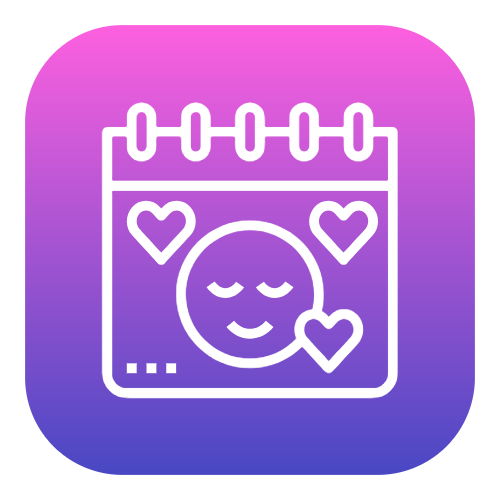

<p align="center">
  
</p>

# Life Tracker & Analytics

[English](README.md) | [Español](README.es.md)

[](https://react.dev/)
[](https://www.typescriptlang.org/)
[](https://vitejs.dev/)
[](https://tailwindcss.com/)
[](https://vercel.com/)
[](https://dexie.org/)
[](https://www.gnu.org/licenses/agpl-3.0)

---

## Descripción del Proyecto
Life Tracker Analytics es una aplicación web integral en React, enfocada en la privacidad, diseñada para ayudarte a registrar tus métricas de bienestar diario y descubrir patrones útiles a través del análisis de datos. Permite registrar estado de ánimo, etiquetas de sentimientos (mood tags), sueño, niveles de concentración, hábitos diarios y medicamentos.

## Tecnologías Utilizadas
- **Frontend:** React 19, TypeScript
- **Build Tool:** Vite
- **Estilos:** Tailwind CSS v4
- **Visualización de Datos:** Recharts
- **Iconos:** Lucide React
- **Base de Datos Local:** Dexie.js (IndexedDB), Exportación e Importación Manual de JSON, remoteStorage.js (BYOD Sincronización en la Nube)

## Aprendizajes Clave
La creación de esta aplicación me permitió profundizar en:
- **Manejo de Datos Simples:** Almacenar y manejar datos localmente (Dexie.js) sin necesidad de recurrir a bases de datos complejas.
- **Arquitectura de Nube BYOD:** Adoptar un modelo "Bring-Your-Own-Data" mediante remoteStorage.js para lograr la sincronización multiplataforma sin depender de un BaaS propietario, evitando el "vendor lock-in" y las revisiones burocráticas de APIs (ej. Google OAuth Trust & Safety).
- **Lógica en el Frontend:** Realizar cálculos sencillos directamente en el cliente (JS/TS), lo cual reduce la necesidad de usar un backend en Python.
- **Experiencia de Usuario (UX):** Mejorar el flujo de entrada de datos diarios.
- **Visualización de Datos:** Aplicar mis conocimientos analíticos y de visualización utilizando Recharts para generar gráficos interactivos de impacto real, en lugar de cálculos engañosos.

## Despliegue y PWA
La aplicación está diseñada para ser publicada en Vercel y puede ser instalada en tus dispositivos como una Aplicación Web Progresiva (PWA). Esto significa que puedes usarla como una app nativa en tu móvil o PC, de forma completamente offline, y tus datos se mantienen locales hasta que decidas sincronizarlos.

## Instalación y Desarrollo Local

```bash
# Clonar repositorio
git clone https://github.com/AnaCataVC/life-tracker-analytics.git
cd life-tracker-analytics

# Instalar dependencias
npm install

# Iniciar servidor de desarrollo local
npm run dev

# Compilar para producción
npm run build
```

## Licencia
Este proyecto está licenciado bajo la [Licencia GNU AGPLv3](LICENSE). Esto garantiza que cualquier modificación o mejora a la aplicación, incluso si se provee a través de una red (como una PWA), también debe ser de código abierto bajo los mismos términos y dando crédito al autor original.

