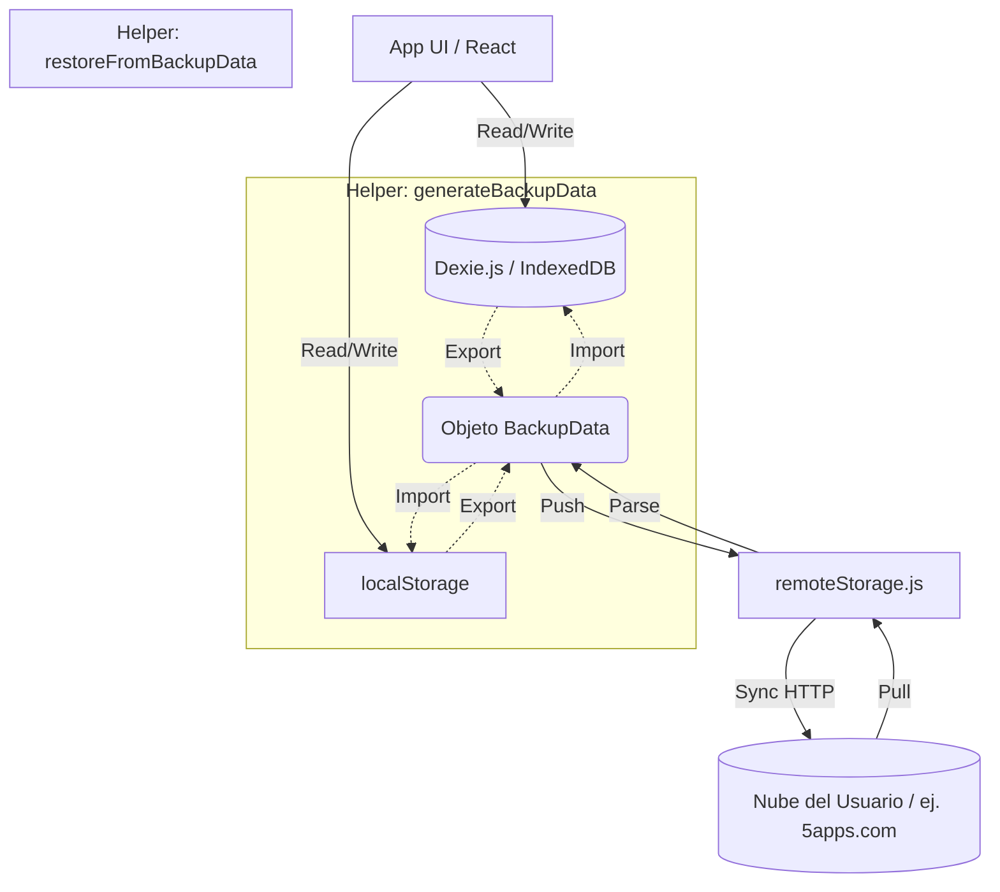

# Flujo de Sincronización en la Nube (BYOD)

**Life Tracker Analytics** utiliza un modelo de arquitectura *Bring-Your-Own-Data* (BYOD). Esto significa que la aplicación no cuenta con un backend centralizado ni base de datos propietaria en la nube. 

Toda sincronización de red se realiza utilizando el protocolo estándar abierto [remoteStorage](https://remotestorage.io/).

## 1. Concepto Central: La Nube como un Destino de Respaldo

La aplicación es **100% Local-First**. La fuente única de verdad siempre es la base de datos local `Dexie.js` (IndexedDB).

`remoteStorage` **no se utiliza para lectura/escritura en tiempo real de registros individuales**. En lugar de eso, la nube actúa exactamente igual que la función de "Exportar a JSON Manual":
- Se toma una "foto" (snapshot) del estado actual completo (registros de Dexie, configuración de localStorage, plantillas).
- Se empaqueta todo en un objeto TypeScript genérico (`BackupData`).
- Se sube ese único archivo (nombrado `lifetracker_backup.json`) al almacenamiento remoto del usuario.

## 2. Componentes Clave

### `src/utils/remoteStorage.ts`
Este módulo es el punto de entrada para instanciar el cliente.
- Exporta `rs`: La instancia global de `RemoteStorage`.
- Exporta funciones asíncronas puras para interactuar con la nube (`pushBackupToRS` y `pullBackupFromRS`).

### `src/components/RemoteStorageWidget.tsx`
Un componente de React muy ligero que monta el widget oficial en vainilla JS (`RemoteStorage.Widget`). Este componente maneja el flujo OAuth y la conexión de la cuenta de manera totalmente automatizada para el usuario.

## 3. Flujos de Trabajo (Workflows)

### Autoguardado (Autosave)
Cuando el usuario tiene el widget conectado a su nube personal:
1. El usuario guarda un nuevo registro del día en el formulario (`App.tsx` -> `handleSaveEntry`).
2. Se guarda el registro en Dexie localmente.
3. El sistema detecta la conexión y ejecuta silenciosamente `pushBackupToRS()` en segundo plano, enviando el backup JSON unificado a la nube.

### Restauración Manual (Pull)
Para evitar que un dispositivo viejo o desactualizado sobrescriba los datos locales por accidente, la restauración nunca es automática al abrir la app.
1. El usuario navega a Configuración y presiona el botón "Restaurar de Nube".
2. Ejecuta `pullBackupFromRS()`.
3. Se invoca `restoreFromBackupData()` que actualiza el Dexie local, sobreescribe los objetos en `localStorage` y actualiza los `states` de React.

## 4. Diagrama de Arquitectura

